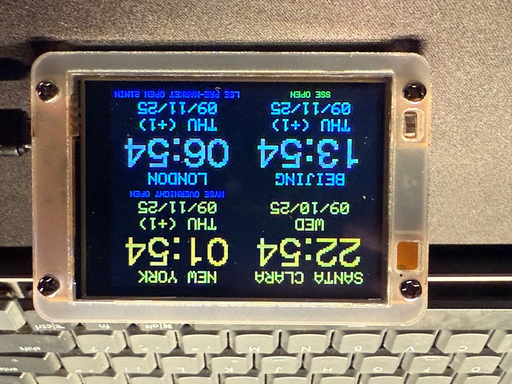
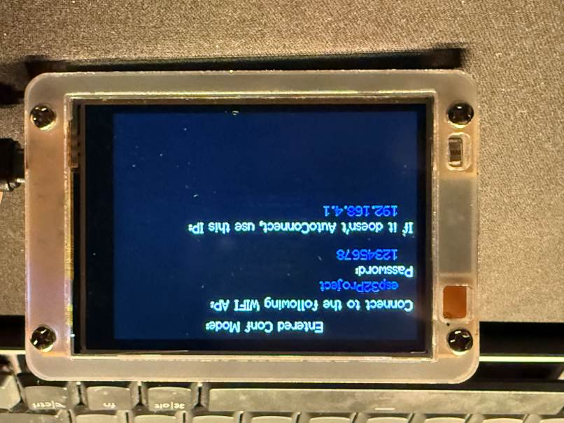
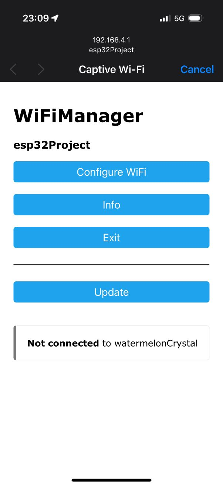

# ESP32WorldClock
 

# Hardware

- ESP32 with 320 x 240 2.8" LCD display ([ESP32-Cheap-Yellow-Display](https://github.com/witnessmenow/ESP32-Cheap-Yellow-Display/))

# Setup

1. [Install Arduino IDE and CH340 USB to UART Driver](https://github.com/witnessmenow/ESP32-Cheap-Yellow-Display/blob/main/SETUP.md)
2. Copy `libraries` to `C:\Users\[YOU_USER_NAME]\Documents\Arduino\libraries`
3. Copy `secrets.h.example` to `secrets.h` and fill in your WiFi credentials
   (see "Connect Wifi" below). `secrets.h` is git-ignored so your credentials
   are never committed.
4. Build and upload with Arduino IDE

# Connect Wifi

There are two ways to get the clock online:

1. **Preconfigured credentials (optional):** Set `PRECONFIGURED_SSID` /
   `PRECONFIGURED_PASSWORD` in your local `secrets.h`. On boot the device tries
   these first (5 second timeout). Leave the placeholders unchanged to skip this.
2. **WiFiManager captive portal (fallback):** If the preconfigured connection
   fails — or you double-press reset to force config mode — the device starts a
   captive portal. Connect to SSID `esp32Project` (password `12345678`) and use
   the portal to enter your WiFi, time zone, 24-hour clock and US date format
   preferences. These are saved to flash for next boot.

  
  

# Web Configuration

Once online, the device runs a small web page for changing settings without
re-flashing. Browse to `http://<device-ip>/` (the IP is shown on screen at
startup and via the `WIFI` serial command). From there you can set, for each of
the four quadrants:

- **Label** – the name shown above the clock
- **Timezone** – any IANA tz database name (e.g. `Asia/Tokyo`)
- **Market** – optional exchange status (NYSE / SSE / LSE / None)
- **Home zone** – drives auto-brightness and the +1/-1 relative-date hint

plus the 12/24-hour and US/non-US date-format toggles. Saving writes the
settings to flash and reboots to apply them.

# Market Status

Zones assigned a market show that exchange's live trading status (open,
pre-market, after-hours, closing, opening/closing countdown, closed, or
holiday) in its local time. Weekends and public holidays are treated as closed.
The bundled holiday tables cover 2025–2026 and should be updated annually
(`*_HOLIDAYS` in `ClockLogic.h`); the Chinese (SSE) calendar is lunar and only
approximate.

# Status Indicator

A small dot at the centre of the screen shows connectivity: **green** = online
and time synced, **yellow** = online but NTP needs a refresh, **red** = WiFi
down or time not yet set. If WiFi drops, the device reconnects automatically.

# OTA Updates

Over-the-air firmware updates are enabled (hostname `esp32worldclock`). After the
first USB flash you can upload wirelessly from the Arduino IDE (the device
appears as a network port). Set `OTA_PASSWORD` in `secrets.h` to require a
password; leave it blank to allow updates from anyone on your LAN.
