# CYD World Clock

<p align="center">
  
</p>

# Hardware

- ESP32 with 320 x 240 2.8" LCD display ([ESP32-Cheap-Yellow-Display](https://github.com/witnessmenow/ESP32-Cheap-Yellow-Display/))

# Setup

There are two ways to get the firmware onto a device:

- **Flash a released image** (next section) — no toolchain or libraries
  needed, just a USB cable. Start here if you only want to run the clock.
- **Build from source** (see "Building" below) — needed if you want to change
  the code, preconfigure WiFi credentials or set an OTA password. Copy
  `secrets.h.example` to `secrets.h` first and fill in your values
  (`secrets.h` is git-ignored so your credentials are never committed). All
  three toolchains use the vendored `libraries/` folder in this repo (its
  TFT_eSPI copy carries the display config for the CYD), so no library
  installation is needed except for the Arduino IDE.

## Flashing a release (no build needed)

Each [GitHub release](../../releases/latest) has a
`esp32worldclock-<tag>-factory.bin` attached: a full flash image (bootloader +
partition table + app) that brings a brand-new ESP32 to a working clock in one
step.

1. Download `esp32worldclock-<tag>-factory.bin` from the
   [latest release](../../releases/latest).
2. Connect the CYD over USB. If no serial port appears, install the
   [CH340 USB-to-UART driver](https://github.com/witnessmenow/ESP32-Cheap-Yellow-Display/blob/main/SETUP.md)
   (the port shows up as `COMx` on Windows, `/dev/ttyUSB0` on Linux,
   `/dev/tty.usbserial-*` on macOS).
3. Flash the image to offset `0x0` with
   [esptool](https://docs.espressif.com/projects/esptool/) (`pip install
   esptool`):

   ```
   esptool.py --chip esp32 --port COM3 --baud 921600 write_flash 0x0 esp32worldclock-<tag>-factory.bin
   ```

   Replace `COM3` with your port. No install needed alternative: open
   [Espressif's web flasher](https://espressif.github.io/esptool-js/) in
   Chrome/Edge, connect, and program the same file at address `0x0`.
4. Press reset (or replug USB). The released binaries are built without WiFi
   credentials, so the device starts the `esp32Project` captive portal — see
   "Connect Wifi" below to get it online.

Flashing at `0x0` replaces the bootloader, partition table and app, so it also
works to recover a device in a bad state or one running different firmware.
If a previous project left settings behind that you want gone, run
`esptool.py --chip esp32 --port COM3 erase_flash` first (this also wipes any
stored WiFi credentials).

Once the device is on WiFi, future releases don't need the cable: upload the
release's `esp32worldclock-<tag>-ota.bin` through the web updater at
`http://esp32worldclock.local/update` (see "Over-the-air updates" below).
Settings and WiFi credentials survive OTA updates.

## Building

**PlatformIO** (fastest incremental builds):

```
pio run                 # build
pio run -t upload       # build + flash
pio device monitor      # serial monitor (115200 baud)
```

**arduino-cli**:

```
arduino-cli compile --fqbn esp32:esp32:esp32:PartitionScheme=min_spiffs --libraries libraries .
arduino-cli upload -p COM3 --fqbn esp32:esp32:esp32:PartitionScheme=min_spiffs .
```

**Arduino IDE**:

1. [Install Arduino IDE and CH340 USB to UART Driver](https://github.com/witnessmenow/ESP32-Cheap-Yellow-Display/blob/main/SETUP.md)
2. Copy `libraries` to `C:\Users\[YOU_USER_NAME]\Documents\Arduino\libraries`
3. Select board "ESP32 Dev Module" and set Tools → Partition Scheme →
   "Minimal SPIFFS (1.9MB APP with OTA/190KB SPIFFS)", then build and upload

## Testing

Hardware-independent logic (boot WiFi-credential ordering, calendar math,
clock formatting, hostname/MAC sanitising, trading-session timing) is factored
into small Arduino-free modules and covered by host [Unity](https://github.com/ThrowTheSwitch/Unity)
tests that run on your development machine — no ESP32 needed:

```
pio test -e native
```

On this project's Windows setup the `native` platform needs MinGW g++ on
`PATH`; use the wrapper `./test/run_native_tests.ps1` (PowerShell), which adds
it for the run. See [`test/README.md`](test/README.md) for the suite list and
how to add a test. The `test_wifi_credentials` suite specifically pins down the
"stuck at *System initializing…*" boot bug so it can't regress.

## CI builds and releases

Every push and pull request is build-verified by GitHub Actions
([`.github/workflows/build.yml`](.github/workflows/build.yml)), which uploads
the compiled images as a workflow artifact. To publish a release with
firmware attached, push a version tag:

```
git tag v1.0.0
git push origin v1.0.0
```

The release gets two files: `esp32worldclock-<tag>-ota.bin` (app image —
upload it straight through the web updater below, no toolchain needed) and
`esp32worldclock-<tag>-factory.bin` (bootloader + partition table + app, for
a first USB flash — see "Flashing a release" above). CI builds from
`secrets.h.example`, so release binaries contain no WiFi credentials — a
freshly flashed device opens the captive portal, and OTA-updated devices
keep their stored settings.

## Over-the-air updates

Once a build with OTA support is on the device, later updates can go over
WiFi — no USB cable needed. The device advertises itself as `esp32worldclock`
on mDNS (the hostname is configurable on the web settings page, so two clocks
on one network don't collide; its IP is also shown on the System status
page), and shows a
progress bar on the display during the transfer before rebooting into the
new firmware. There are two ways in:

- **Web page** (no tools needed): browse to `http://esp32worldclock.local/update`
  (or follow the *Firmware update* link from the settings page at
  `http://<device-ip>/`), pick a compiled firmware image and press
  *Update firmware*. The `.bin` to upload is
  `.pio/build/cyd/firmware.bin` for PlatformIO, the exported binary from
  Arduino IDE → Sketch → Export Compiled Binary, or add
  `--output-dir build` to the `arduino-cli compile` command. The page shows
  upload progress and the running build's compile timestamp.
- **PlatformIO / espota**: uncomment the `espota` lines in `platformio.ini`
  and `pio run -t upload` as usual. In the Arduino IDE, pick the network
  port named `esp32worldclock` under Tools → Port.

<p align="center">
  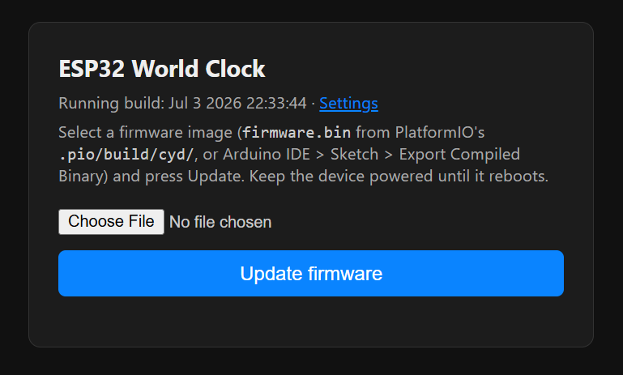
  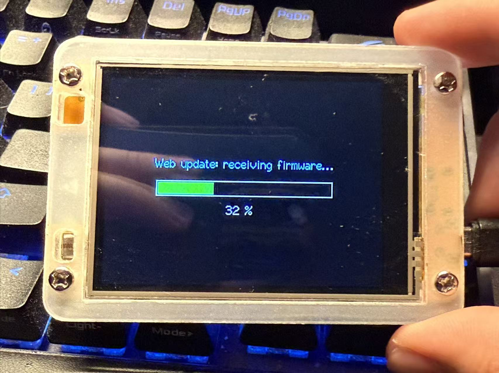
</p>

OTA is unauthenticated by default (anyone on your WiFi can flash the
device); set `OTA_PASSWORD` in `secrets.h` to protect both paths — the web
page then asks for HTTP Basic credentials (username `admin`), and espota
needs `upload_flags = --auth=<password>`.

Display settings (timezones, formats, brightness, face) and WiFi credentials
survive OTA updates — only the app partition is rewritten.

## Partition scheme

All three toolchains should use the **Minimal SPIFFS** partition scheme (two
1.9MB OTA app slots + 128KB SPIFFS). PlatformIO picks it up automatically from
`platformio.ini`; for arduino-cli / Arduino IDE it is selected as shown above.
The firmware fills ~96% of the default scheme's 1.31MB app slots, so this
scheme is what leaves room for the binary to grow (the sketch keeps only a
<1KB config JSON in SPIFFS, so the smaller filesystem costs nothing).

Note: the first flash after switching partition schemes relocates the SPIFFS
region, so the on-device display settings (timezones, clock/date format,
brightness) reset to defaults once. WiFi credentials and the timezone cache
live in NVS and survive.

# Connect Wifi

There are two ways to get the clock online:

1. **Known credentials:** On boot the device rotates through the WiFi
   credentials it knows (up to 10 attempts, 5 seconds each): the network last
   saved through the config portal first, then the optional
   `PRECONFIGURED_SSID` / `PRECONFIGURED_PASSWORD` pair from your local
   `secrets.h` (leave the placeholders unchanged to skip the latter).
2. **Setup portal (fallback):** If none of those connect — or you double-press
   reset to force setup mode — the device starts a captive setup portal.
   Connect to SSID `esp32Project` (password `12345678`) on a phone and a setup
   page opens automatically; pick your network and enter its password. The clock
   connects while keeping the hotspot up, so if the network needs a captive-portal
   login you complete it on your phone through that same hotspot (see
   [Login-required networks](#login-required-networks-captive-portals) below).
   The credentials are saved to flash and become the first-tried network on every
   later boot. (Time zone and display options are set afterwards on the web
   settings page.)

The whole sequence plays out live on the boot screen: it mirrors the log as a
console (which network is being tried, each attempt's count and failure
reason, portal / NTP / timezone progress), so the boot never sits on a silent
"System initializing..." message.

If nobody uses the portal within 5 minutes, the device reboots and retries the
whole sequence (saved + preconfigured credentials first). So after a power cut
where the router comes back later than the clock, the clock reconnects on its
own — no button pressing needed.

If you *do* enter credentials in the portal and the join fails, the clock no
longer reboot-loops silently: it shows a **WiFi connect failed** page with the
network name and the likely reason (network not found / join rejected — wrong
password? / no response), plus a **Reboot** button (retry now; the portal
reopens if it keeps failing) and a **Settings** button to browse the status
pages and logs. WiFi keeps retrying in the background — if it comes up, the
page returns to the clock on its own; untouched for 5 minutes, it reboots so
unattended recovery still works.

## Login-required networks (captive portals)

Some networks (hotels, offices, campuses, guest Wi-Fi) let a device join but
block the internet until you sign in on a web page — and they grant that access
per **MAC address**. The clock has no browser to complete such a login itself,
so on these networks it associates fine but NTP, weather and holidays fail. The
clock detects this and shows a steady `WIFI LOGIN REQUIRED` label at the bottom
of the home screen (the System status page and `/api/status` also report
`internet: captive`). There are three ways to get it online:

- **Log in through the clock (easiest).** On the device, open **Settings →
  WiFi login**, or browse to `http://<device-ip>/wifi-login` and press *Start
  login helper*. The clock brings up a temporary hotspot (SSID
  `<hostname>-login`, password `12345678`) and routes its traffic through your
  phone's login: join that hotspot on your phone, complete the network's login
  in your browser, and the clock inherits the access (the network authorizes the
  clock's own MAC). The clock's screen shows progress and returns to normal once
  it is online. This works even for HTTPS / JavaScript portals, because the
  clock only forwards packets — your phone talks to the portal directly.
- **Register the clock's MAC.** If the network has a device-registration page,
  add the clock's MAC (shown on `/wifi-login`, the Network status page, and
  `/api/status`).
- **Clone an authorized device's MAC.** Enter a MAC the network has already
  authorized (e.g. your phone's) in **Custom MAC** on the web settings page;
  the clock then presents that address. Disable your
  phone's "private/random MAC" for the network first, and don't keep both on the
  network at once with the same MAC. A cloned MAC is marked with `*` on the
  Network status page and applies after a reboot.

**Skipping a stuck boot.** The `System initializing...` boot screen carries a
**Settings** button. Booting on a network with no usable internet (or none at
all) normally means minutes of connection retries, portal waits and reboot
loops — tap the button instead and the clock cuts the remaining network waits
short and opens the settings page directly, so the **WiFi login** helper,
**Status** and **Logs** are immediately reachable at the new location. The
WiFi link keeps retrying in the background meanwhile, and time falls back to
the built-in timezone rules until real internet arrives.

**If WiFi drops while the clock is running**, the clock keeps ticking (time
runs locally between NTP syncs) and recovers in stages: after a minute
offline a steady `NO WIFI` label appears at the bottom of the home screen
(and the System status page shows the WiFi row in red), every 3 minutes an
explicit reconnect is kicked in case the WiFi stack's auto-reconnect has
wedged, and after 30 minutes offline the device reboots into the full boot
recovery sequence above. A clock that lost its network during a multi-hour
router outage therefore rejoins on its own once the router is back.

<p align="center">
  
  
</p>

# Touch Screen Controls

The home screen is split into three touch zones (the same on every clock
face):

| Zone | Action |
| --- | --- |
| Left third | Decrease backlight brightness |
| Center third | Open the **Settings** page |
| Right third | Increase backlight brightness |

<p align="center">
  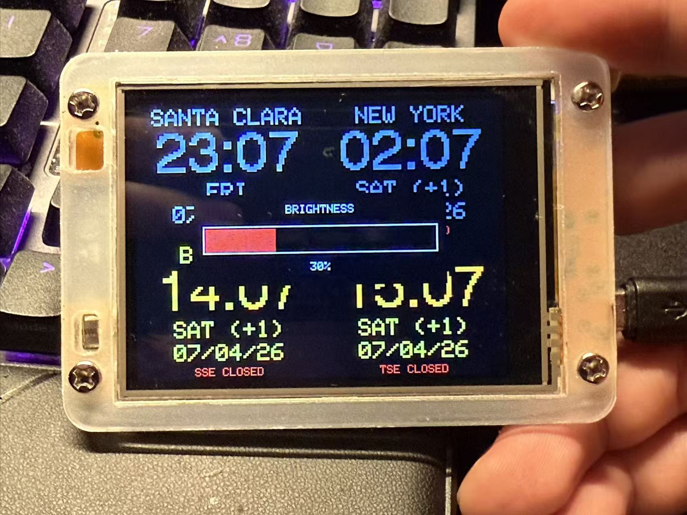
</p>

# Clock faces

The home screen has five faces, cycled with the **Clock face** button on the
settings page (the choice is saved to flash):

- **World clock** — the classic four-quadrant view: one timezone per quadrant
  with date, day-offset vs. home and stock market status. On a public
  holiday in a zone's country, that quadrant's day line turns gold and shows
  the holiday's name next to the day (e.g. `WED - INDEPENDENCE DAY`); the
  date stays visible as usual. Each zone's colors follow the sun's real
  position at that city (computed from its coordinates — no network needed):
  daytime is orange/yellow from actual sunrise to actual sunset, so London
  correctly reads as night at 4:30 PM in December and as day at 9 PM in
  June. This face also carries a set of extras, each individually
  switchable from the web settings page (all on by default; turning one off
  restores the classic look):
  - **Sun/moon icons + night colors** — a small sun or crescent moon in each
    quadrant's corner marks day/night explicitly, which frees the text
    colors to stay readable around the clock: warm orange by day, cool ice
    blue in the evening and a dimmer steel blue in the small hours (off =
    the legacy grey-on-black night colors, no icons).
  - **Home quadrant border** — a subtle accent border around the top-left
    (home) quadrant, the reference all the `(+1)` day offsets are computed
    against.
  - **Weather in quadrants** — current temperature on each quadrant's date
    line with a condition color dot (yellow clear, cyan rain, white
    snow...), reusing the data the background weather task already fetches
    every 20 minutes for the weather face.
  - **Daylight bar** — a thin gradient bar under each time mapping that
    city's full day (midnight to midnight) left to right, colored by the
    sun's real elevation — deep blue night, orange sunrise/sunset, warm
    yellow midday — with a white tick at "now". One glance shows how deep
    into day or night each city is.
  - **Market-session progress bar** — while an exchange is inside its
    regular hours, a green bar along the quadrant's bottom edge fills from
    open to close (half-day early closes shorten it), showing how much of
    the trading day is left.
  - **Smooth time digits** — the quadrant times render in an anti-aliased
    52pt font (a digits-only Liberation Sans Bold subset, ~12KB of flash,
    regenerable with `tools/make_time_font.py`) instead of the blocky
    pixel-doubled built-in font. Off = the classic Font 4 look.
  - **Weather alerts** — a severe-weather alert on a quadrant's market status
    line (in orange). For US cities the text comes from the official US
    National Weather Service active-alerts feed
    ([api.weather.gov](https://www.weather.gov/documentation/services-web-api),
    e.g. `TORNADO WARNING`); for other cities it is derived from the weather
    code the clock already fetches (`STORM`, `HEAVY SNOW`, `FREEZING RAIN`…).
    If the quadrant has no market, the alert shows on its own; if it does, the
    line alternates slowly between the market status (shown longer) and the
    alert, so you still see both without either flickering. Refreshed every 20
    minutes with the weather. (Shown on the four-quadrant face; the big-clock
    face's single market line is unchanged.)
- **Big clock** — the home zone (top-left quadrant) in 75px digits with date
  and market status, plus a mini strip of the other three zones' times along
  the bottom.
- **Calendar** — a month calendar for the home zone with today highlighted,
  and the current time in the header. The week starts on Sunday (or Monday —
  web settings page). Public holidays are marked in gold (today's highlight
  box also turns gold on a holiday), and a footer line names today's holiday
  — or the next upcoming one (`NEXT: 25 DEC - CHRISTMAS DAY`).
- **Weather** — current temperature and conditions for all four configured
  cities (with each city's local time), from the free
  [Open-Meteo](https://open-meteo.com) API — no API key needed. A background
  task fetches every 20 minutes (configurable on the web settings page, in
  °C or °F) regardless of which face is showing, so the data is ready the
  moment the face opens and the clock never pauses. Weather is only available
  for cities picked from the preset timezone list, since it needs their
  coordinates.
- **Markets** — every exchange the clock knows about (NYSE, LSE, SSE, TSE,
  HKEX) at a glance, independent of which cities occupy the quadrants: one
  row per exchange with its local time and the same colored
  open/closed/countdown status as the quadrant view. These rows tick on
  built-in timezone rules, so the face works even without the timezone
  server.

<p align="center">
  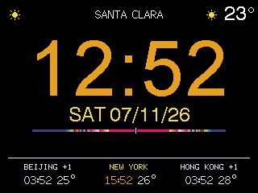
  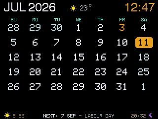
  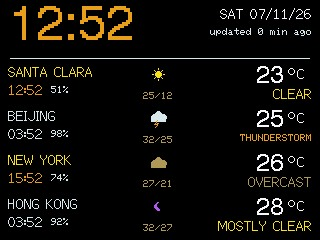
</p>

## Settings page

<p align="center">
  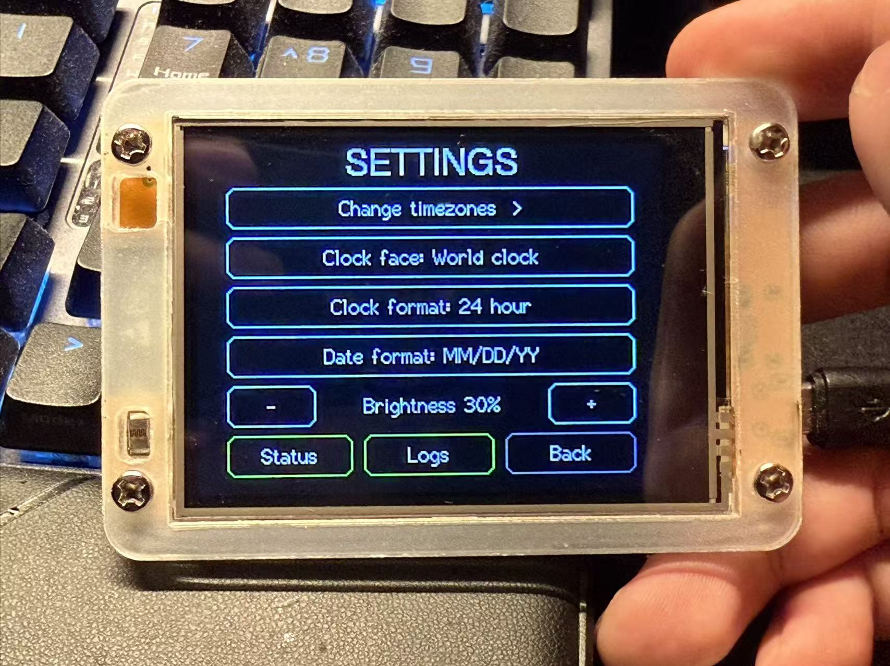
  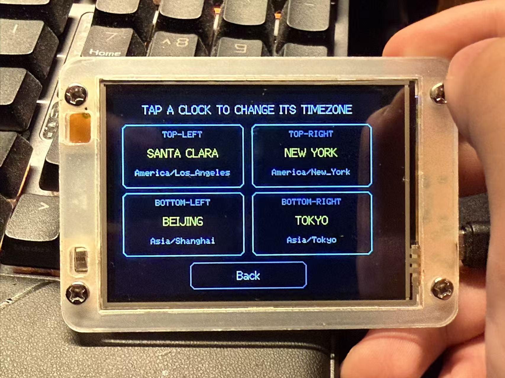
  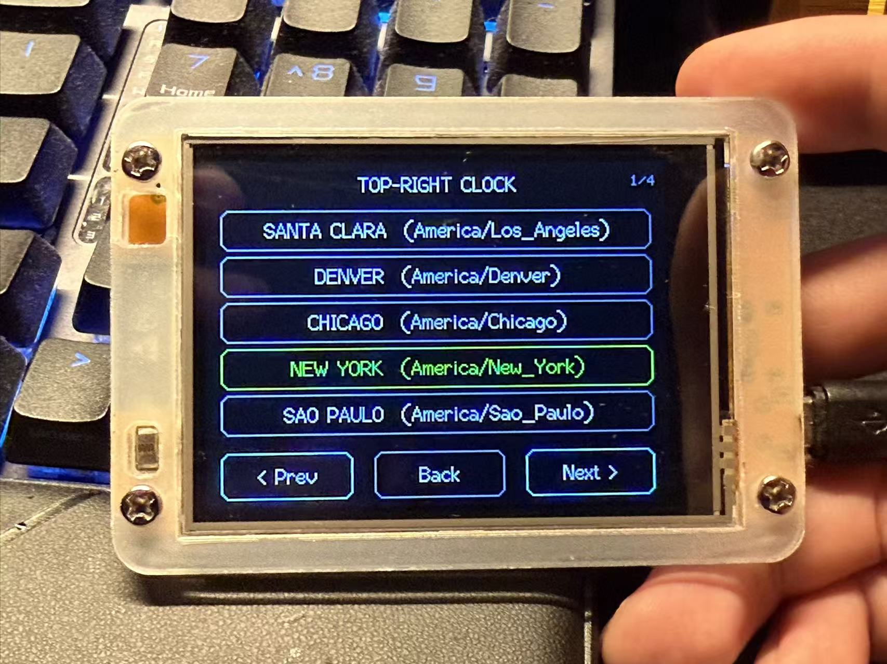
</p>

- **Change timezones** — tap any of the four clock slots, then pick a city from
  the paged timezone list. Cities with a stock exchange (New York, London,
  Beijing, Tokyo, Hong Kong) automatically show that market's trading status,
  color-coded: green while the exchange is open, yellow with a countdown when
  the next regular open is less than 24 hours away (e.g. `NYSE OPENS IN
  5H 03M`), and a plain red `CLOSED` when the open is further out (weekends
  viewed early, long holiday closures — multi-day countdowns like `2D 8H`
  were too easy to misread as a time). Full-day exchange holidays are
  respected — the status shows closed on holidays and the countdown skips
  them — and so are half-day early closes (NYSE Black Friday / Christmas Eve
  1 PM, LSE 12:30 on Christmas/New Year's Eve, HKEX noon closes): the status
  flips to closed at the early-close time instead of running hours long. The
  selection is saved to flash and restored on boot.

  Exchange holiday calendars keep themselves current: once a week the device fetches
  [`marketHolidays.json`](marketHolidays.json) from this repository over
  HTTPS and caches it in flash, so updating that file (when an exchange
  publishes next year's schedule) reaches every clock within a week — no
  reflash needed. The file carries full-day closures (`"holidays"`, YYYYMMDD
  integers) and half-day early closes (`"earlyCloses"`, `"YYYYMMDD:HHMM"`
  strings, e.g. `"20261224:1300"` for a 1 PM close). Compiled-in tables
  (2026–2027 for NYSE/LSE, 2026 for SSE/TSE/HKEX, in `marketHolidays.cpp`)
  serve as the offline fallback. Type `HOLIDAYS` in the serial monitor to
  inspect the active calendars or force a refetch, and set
  `MARKET_HOLIDAYS_URL` in `secrets.h` to point a forked device at your own
  copy of the file.
- **Clock face** — cycle between the four home-screen faces (see above).
- **Clock format** — toggle between 24-hour and 12-hour (AM/PM) display.
- **Date format** — toggle between `DD/MM/YY` and `MM/DD/YY`.
- **Quadrant grid** — toggle divider lines between the four quadrants of the
  world-clock face (default: off).
- **Wx alert** — toggle weather alerts on the quadrant market status lines
  (see the *Weather alerts* extra above; default: on).
- **Brightness** — `-` / `+` buttons adjust the backlight (also pauses
  auto-brightness for 2 hours, same as the home-screen gesture). The level is
  saved and restored on the next boot, and is used as the daytime target by
  auto-brightness.
- **System status** — opens a live diagnostics page.
- **Logs** — shows the most recent log lines right on the display (see
  below).

## Public holidays

The world-clock quadrants and the calendar face mark each zone's public
holidays by name (see the face descriptions above). The names come from the
free [Nager.Date](https://date.nager.at) API — no key needed — fetched in the
background per zone country (one small request per country-year: on boot,
weekly, when a zone changes and at the year rollover), so the clock itself
never pauses. Only nationwide holidays are shown; regional ones are filtered
out. Dubai and Mumbai have no calendars on that API, so those zones simply
show no holidays. Type `HOLIDAYS` in the serial monitor to see what data
each zone currently has.

## Web settings page

Everything on the settings page can also be changed from a browser: go to
`http://esp32worldclock.local/` (or the device IP shown on the System status
page) to pick the four timezones, clock face, quadrant grid, clock/date
format and brightness without touching the device. The page is organized
into categories:

- **Clocks & time** — the four timezones and the clock/date formats.
- **Display** — the clock face, plus *Flip display 180°* for clocks mounted
  upside down (rotates the whole UI including touch; applies immediately and
  from the first boot screen).
- **Brightness** — the brightness slider, the auto-dim master switch
  (default: on; Off keeps the backlight at the set brightness at all times,
  ignoring both the light sensor and the night window), the night backlight
  level (default: minimum) and the fallback dim window (default 1–7 AM
  home-zone time, used when the light sensor is unavailable; the window may
  wrap midnight, and equal start/end hours disable it).
- **World-clock face** — On/Off toggles for the quadrant grid and the
  face's extra elements: sun/moon icons + readable night colors, the
  home-quadrant border, per-quadrant weather, the daylight bar, the
  market-session progress bar, the smooth (anti-aliased) time digits and
  weather alerts on the market status line (see the face description above).
  The extras all default to on; switching one off restores the classic look
  of that element. (Weather alerts and the quadrant grid also have on-device
  toggles on the settings page.)
- **Weather & calendar** — temperatures in °C or °F (weather face and
  per-quadrant weather), the weather refresh interval (default: every 20
  minutes) and whether the calendar face's week starts on Sunday or Monday.
- **Network** — the mDNS hostname the device advertises (`<hostname>.local`,
  default `esp32worldclock`; change it when running two clocks on one
  network, applied on the next reboot) and the custom MAC for login-required
  networks.
- **Config backup / restore** — the *Backup config* link downloads all
  settings as JSON (also available at `/api/config`); picking a backup file
  next to *restore* uploads it back, after which the device saves it and
  reboots. Handy for cloning a second clock, or for restoring the display
  settings after a partition-scheme change wipes SPIFFS. Scriptable too:
  `curl http://esp32worldclock.local/api/config -o backup.json` and
  `curl -X POST --data-binary @backup.json http://esp32worldclock.local/api/config`.

The page also links to the firmware updater (`/update`), the log viewer
(`/logs`), a scriptable diagnostics endpoint (`/api/status`, JSON: IP,
RSSI, chip/CPU, flash, heap, uptime, NTP syncs, zones, market status...) and
a live screenshot of the panel (`/screenshot`, a 320x240 BMP read back from
the display controller — see exactly what a remote clock is showing:
`curl http://esp32worldclock.local/screenshot -o clock.bmp`; the clock UI
pauses for the 1–2 s read). `/api/screen?name=<page>` switches the on-device
UI to any page remotely (`home`, `settings`, `zones`, `tzlist`, `status`,
`logs`, `wifilogin`, `wififail`, plus `&page=`/`&slot=` for the status/timezone pages;
without `?name` it reports the current page) — together with `/screenshot`
this drives and captures the whole touch UI for debugging without touching
the device. If `OTA_PASSWORD` is set in `secrets.h`, the same HTTP Basic
credentials (username `admin`) protect these pages.

<p align="center">
  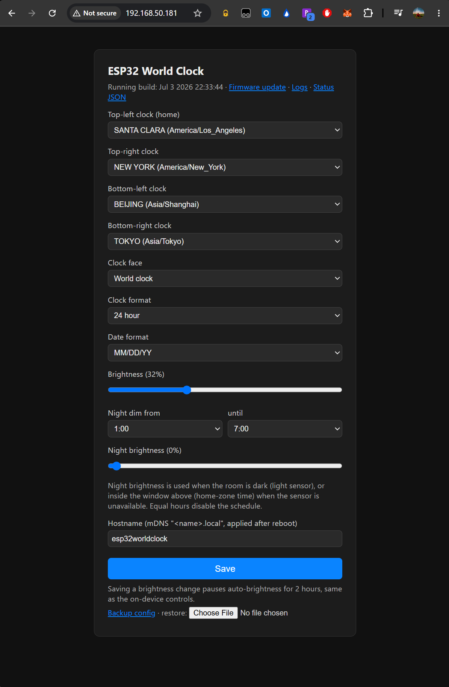
</p>

## Auto-brightness

The clock dims itself using the CYD's onboard light sensor (LDR on GPIO 34):
when the room goes dark the backlight fades to the configured night
brightness, and it fades back to the saved brightness when the lights come
on. The LDR circuit is unreliable on some CYD board revisions, so the sensor
is only trusted after its reading has actually been seen to move; until then
the clock falls back to a time schedule (default: dim between 1–7 AM
home-zone time). The night brightness, the schedule window and the auto-dim
master switch (Off = the backlight never changes on its own) are all
configurable on the web settings page. Type `LDR` in the serial monitor to
see the live readings, and set `LDR_DARK_IS_HIGH` to 0 in `ClockLogic.h` if
your board's sensor reads inverted. Manual brightness changes (touch gesture
or settings page) always win for 2 hours.

## System status pages

Live diagnostics across three pages, refreshed every second — each tap moves
to the next page, and the last tap returns to settings:

- **System (1/3)** — WiFi SSID and signal strength (color-coded, red
  `OFFLINE` when the connection is down), IP address; chip model / revision
  and CPU frequency, plus the CPU temperature on chips that have a sensor
  (the classic ESP32 in the CYD does not); flash size and speed, firmware
  size (with % of the OTA slot used) and the running build's compile
  timestamp; free heap (with the low-water mark since boot), uptime; NTP
  sync count / last sync age and the current UTC time.
- **Network & storage (2/3)** — mDNS hostname, MAC address, gateway, DNS,
  WiFi channel; WiFi dropouts since boot (with the last outage's length and
  how long ago it ended); the reason for the last reset (power-on, software
  reset, crash, brownout... — shown in red after an abnormal one); SPIFFS
  usage, largest allocatable heap block (fragmentation), SDK version.
- **Clock data (3/3)** — home timezone, active face and formats; weather
  data age; market-holiday calendar source (weekly-fetched vs. compiled-in)
  and age; public-holiday tables loaded per eligible zone; current backlight
  level, what's driving auto-brightness (light sensor vs. schedule), any
  manual-brightness hold remaining, and the configured night window.

Everything on these pages is also in the `/api/status` JSON for scripting.

<p align="center">
  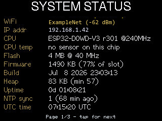
</p>

## Logs page

Everything the firmware logs goes to the serial port **and** into a 6KB
in-RAM ring buffer, each line stamped with the uptime. Two ways to read it
without a USB cable:

- **On the device** — settings → **Logs** shows the newest lines on the
  display, live; tap anywhere to go back.
- **In the browser** — `http://esp32worldclock.local/logs` is an
  auto-refreshing viewer (`/api/logs` serves the same text raw, handy for
  `curl`).

The buffer holds the most recent couple hundred lines; it resets on reboot.

### Remote log shipping

So reboots don't lose history and no device needs to be reachable inbound,
the firmware pushes its log to a central server: by default every device
ships to the project's fleet log server at
`http://esp32-clock-log-collect.echo.cool:3100`. The behavior is configured
in `secrets.h`:

```c
// #define LOG_PUSH_URL "http://my-own-server:3100/loki/api/v1/push"  // self-host
// #define LOG_PUSH_TOKEN "..."   // if the server requires auth
// #define LOG_PUSH_DISABLE       // opt out entirely (compiles to nothing)
```

The device batches log lines every ~30 seconds and POSTs them in the
**Grafana Loki JSON push format**, labeled
`{job="cyd-world-clock", device="<hostname>", boot_id="<random per boot>"}` —
so the target can be the companion
[cyd-world-clock-logs](https://github.com/echo-cool/cyd-world-clock-logs)
server (a one-container FastAPI + SQLite sink with a web viewer, sized for a
tiny VM) or any real Loki instance, interchangeably. Shipping starts after
the first NTP sync (timestamps are anchored to it; lines logged earlier,
including the whole boot sequence, are queued and shipped retroactively).
Batches are retried with backoff and deduplicated server-side, and when the
queue overflows while offline the oldest lines are dropped first. Type
`LOGSHIP` in the serial monitor to see the shipper's status.

Privacy note: the shipped log is the same text as `/logs` and includes
network diagnostics (WiFi SSID, IP addresses, fetched URLs) — define
`LOG_PUSH_DISABLE` if you don't want that leaving the device.

<p align="center">
  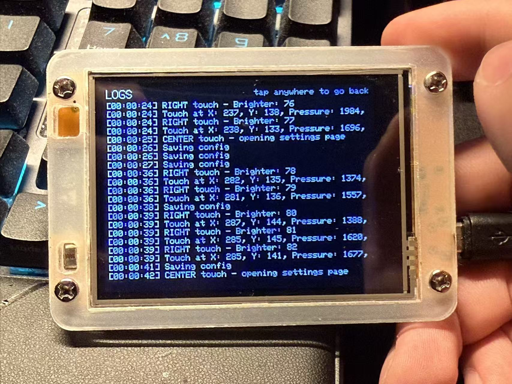
</p>

# Timekeeping

- Time is synced over NTP every 30 minutes (ezTime).
- Until the first sync lands, the clock walks a pool of NTP servers
  (`pool.ntp.org`, `ntp.aliyun.com`, `ntp.tencent.com`, `ntp.ntsc.ac.cn`,
  `time.windows.com`) so it also syncs on networks where the default pool is
  slow or unreachable — typically mainland China. Whichever server answered
  stays selected for the periodic resyncs; the server being tried is shown on
  the system status page and in `/api/status` until then.
- Before the first sync the clock ticks from the firmware build time instead
  of the 1970 epoch, so all four zones show consistent (if not yet synced)
  local times rather than garbled ones.
- Timezone definitions are cached in flash after the first successful lookup,
  so later boots get correct local times even when the timezone server
  (`timezoned.rop.nl`) or the network is unreachable. Cached entries refresh
  automatically once they are older than 6 months, and immediately whenever a
  quadrant's timezone is changed from the settings page.
- Every preset city also carries built-in POSIX timezone rules (including
  DST transitions) as a last resort: if the timezone server is down *and*
  nothing usable is cached — e.g. a first boot, or changing a zone while the
  server is unreachable — the zone still shows correct local time instead of
  falling back to UTC.
